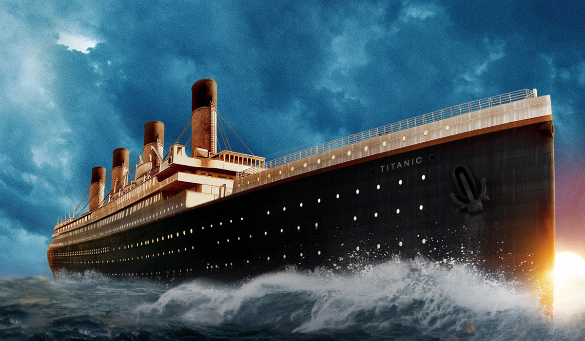

# Titanic: Machine Learning from Disaster

### The Challenge
This is the legendary Titanic ML competition from Kaggle, which has been chosen as our final group project.

The sinking of the Titanic is one of the most infamous shipwrecks in history.

On April 15, 1912, during her maiden voyage, the widely considered “unsinkable” RMS, Titanic, sank after colliding with an iceberg. Unfortunately, there weren’t enough lifeboats for everyone onboard, resulting in the death of 1502 out of 2224 passengers and crew.

While there was some element of luck involved in surviving, it seems some groups of people were more likely to survive than others.

In this challenge, using machine learning and passenger data provided by Kaggle, we built a predictive model that answers the question: "which passengers survived the Titanic shipwreck and what sorts of people were more likely to survive?”. 

### About the Data
The data has been provided as two similar datasets, training and testing, that include passenger information like name, age, gender, socio-economic class, etc.

For the purpose of our project, only the training set has been used to build our machine learning models. This set was the only one to have the outcome (“ground truth”) for each passenger. However, it has been split into training set and testing set during the data cleaning/preparation stage.

All our models were based on “features” like passengers’ gender, class, age, number of children/parents, number of siblings/spouses, fare cost, and port of embarkation.
